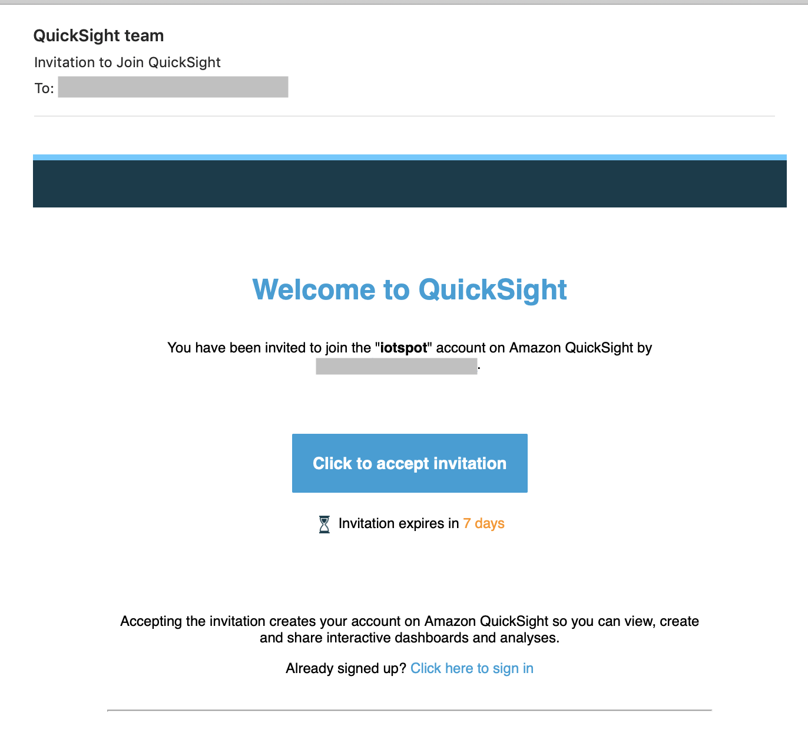
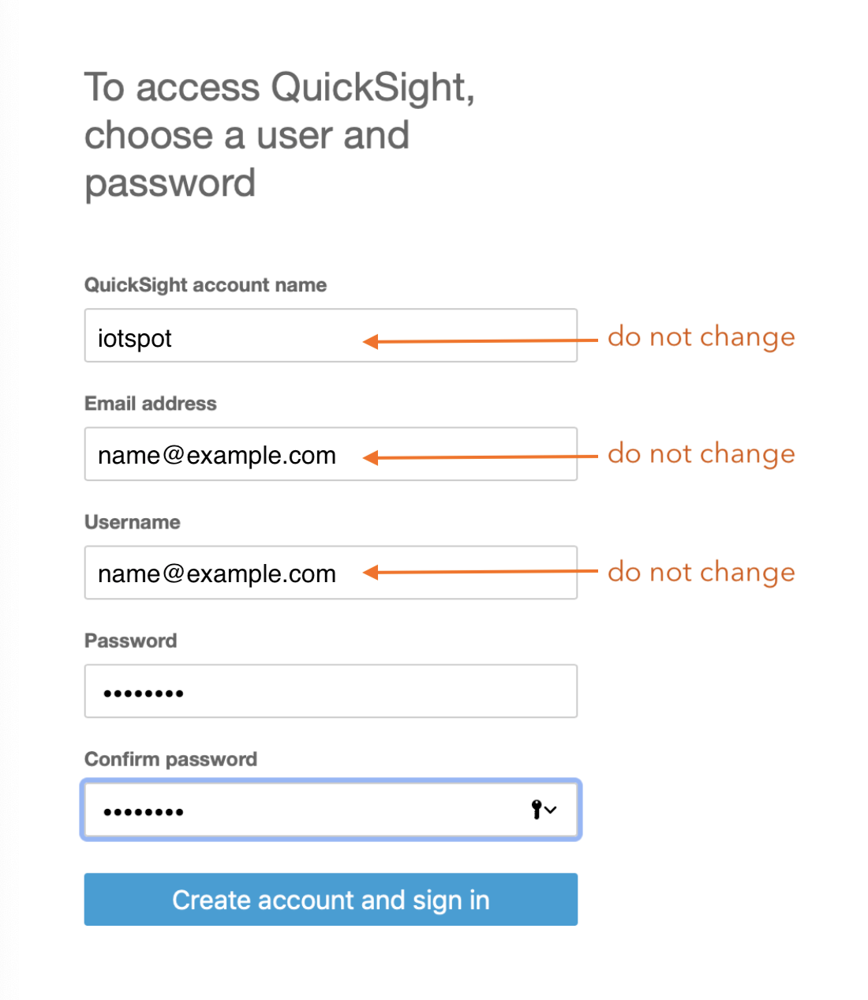
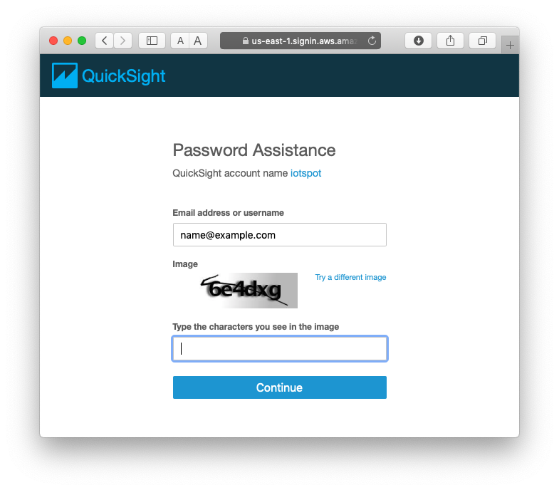
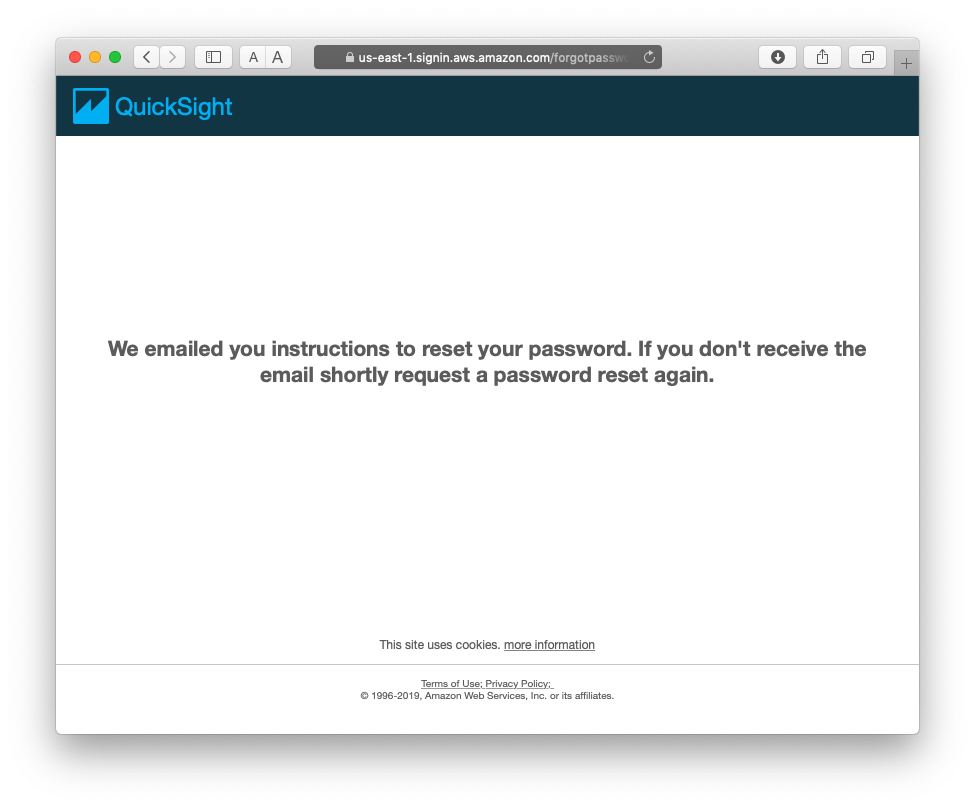

## The iotspot Dashboard

#### Introduction

iotspot offers management information as part of its Smart Workspace Platform by means of dashboards. These dashboards are web-based, require user authorisation, and provide data selection capabilities. They run on the QuickSight platform in Amazon Web Services.

Authorised users are provided with information about the availability or occupancy rate of your workspaces, i.e. desks and/or rooms. In case you have activated monitoring services, the dashboards will also show you the actual utilisation of desks, rooms and/or the interior climate of designated areas.

This dashboard manual provides you with information and guidelines for your use of the iotspot dashboard services.

#### User authorisation

In order to access our dashboards, your organisation needs to specify the email addresses of the employees that are granted access. Optionally, to limit an employee's access to specific locations, you can also specify one or more office locations. If no office location is specified, the employee is granted access to data on all locations where the iotspot service is activated for your organisation.

To authorise users, or request access to the dashboards, please send an e-mail to <a href="mailto:dashboard@iotspot.co?subject=access%20request">support@iotspot.co</a> with the subject line: `access request` and include:
* a list of one or more authorised users, with for each user:
  * first and last name
  * email address, and
  * (optionally) the iotspot office locations for which the user is authorised to view the dashboards.

Within 24 hours, each authorised user will be invited to activate his or her QuickSight user account.

#### User activation

Each user will receive an email from **QuickSight Team** (noreply@quicksight.aws.amazon.com) with subject **Invitation to Join QuickSight**:

{:width="80%"}

In the email, click the blue `Click to accept invitation` button. This opens a web page in your browser that starts with `signin.aws.amazon.com`.

> **IMPORTANT**  
> On this page, do **not** alter the prefilled QuickSight account name (`iotspot`), Email address, or Username fields.

{:width="60%"}

Enter a password, then click `Create account and sign in`.

Finally, click `Continue` to access the iotspot dashboards.

#### Revisiting the iotspot dashboard in QuickSight

To revisit the dashboards in QuickSight, go to: quicksight.aws.amazon.com.

If you are using the _same browser_ as before, it will remember your QuickSight account (`iotspot`). Enter you email address and password and click `Sign in`.

If you are signing in with a _different browser_, then enter QuickSight account: `iotspot` and click `Continue`. On the next page, enter you email address and password and click `Sign in`.

> IMPORTANT  
> The QuickSight **account name** is always `iotspot`; do not use your email address here. In QuickSight, your email address is used as the **username**. 

#### Resetting your password

In case a user has access to the iotspot account in QuickSight and knows the designated email address but has forgotten the password, the user can click `Forgot Password?` at the bottom of the **Sign in to QuickSight** page.

{:width="80%"}

In the **Password Assistance** page, make sure that:  
* verify that the QuickSight account name is `iotspot`
* enter your email address
* enter the characters in the image
* click `Continue`.

You will then see this page:

{:width="80%"}

After you receive the email (check your spam folder if needed), click the reset link to open the **Reset password** page in your browser. Enter and confirm the new password, then click `Continue`. Now continue to sign in with the new password (see **Revisiting the iotspot dashboard in QuickSight** above).
